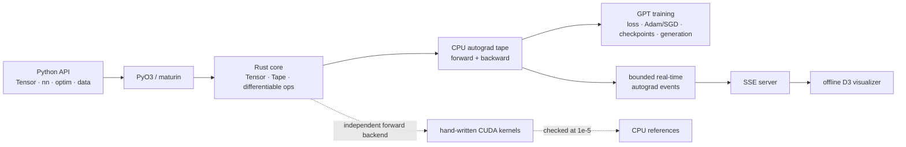

# Glassbox

**A deep-learning engine built from first principles in Rust and CUDA that trains and generates text with a GPT-style transformer.**

Glassbox makes the machinery behind model training inspectable: tensors, broadcasting, a reverse-mode autograd tape, transformer operations, optimizers, checkpointing, sampling, hand-written GPU kernels, and a live graph of the forward and backward passes. The model trains on TinyShakespeare through the Rust CPU tape, while a separate CUDA library exercises the core GPU programming problems—launch geometry, reductions, shared memory, numerical stability, and host/device transfer—against trusted CPU references.

## Demo

https://github.com/user-attachments/assets/c0710580-3ae9-4f39-bbcd-6570d92024cb

## What's inside

- **Differentiable tensor engine:** broadcasting, strided views, reshape, detach, add, multiply, subtract, divide, exponent, logarithm, matrix multiplication, stable softmax, LayerNorm, embedding gather/scatter-add, scaled causal attention, fused cross-entropy, GELU, ReLU, Sigmoid, and Tanh.
- **Tape-based autograd:** append-only operation records, saved forward context, contributing-subgraph discovery, reverse topological traversal, gradient accumulation, and finite-difference checks for every backward rule.
- **GPT-style language model:** token and position embeddings, pre-normalized transformer blocks, single-head causal self-attention, GELU MLPs, residual connections, autoregressive generation, temperature, and top-k sampling.
- **Optimizers:** SGD and Adam with optional decoupled AdamW weight decay, plus global gradient clipping.
- **CUDA kernel library:** elementwise arithmetic and unary operations, axis reduction, matrix multiplication, row-wise softmax, and LayerNorm, tested on a real NVIDIA GPU against CPU results.
- **Python API:** Rust-backed tensors and modules exposed through PyO3 and maturin, with independent `backward()`, `step()`, and `zero_grad()` calls.
- **Live autograd visualizer:** real tape events streamed over SSE; tensors become nodes, operations become edges, and backward styling is scaled by measured gradient norm.
- **Reproducible artifacts:** deterministic training curves, checkpoint round trips, and fixed-seed generation.

## Architecture



The solid path is the end-to-end training system. The dashed CUDA branch is an independently callable and validated forward-kernel library; it does not sit on the model's training path.

## Deliberate scope

- **CPU-tape training:** one complete forward/backward execution path keeps autograd, optimization, checkpointing, and visualization coherent and inspectable.
- **CUDA as the accelerator target:** the kernel library focuses on NVIDIA execution and avoids diluting the work across additional accelerator backends.
- **Single-head attention:** one head contains the complete attention mechanism—projection, scaling, causal masking, softmax, value aggregation, and gradients—without turning a reshape/batching extension into the center of the project.
- **Transformer operations:** the operator set is shaped around language-model training, excluding convolution and pooling families.
- **Python bindings:** PyO3 provides the high-level interface while Rust remains the implementation language and ownership boundary.

## Quickstart

### Requirements

- Rust stable
- Python 3.10 or newer
- A C/C++ build toolchain required by Rust Python extensions
- For CUDA tests: an NVIDIA driver and CUDA Toolkit with `nvcc` on `PATH`

From the repository root:

```bash
python3 -m venv .venv
source .venv/bin/activate
python -m pip install --upgrade pip maturin

maturin develop --release --features extension-module,cpu-only
cargo test --features cpu-only
python examples/train.py
```

The training command runs 100 steps, writes the generated curve to the ignored `runs/loss_curve.csv`, writes an ignored checkpoint to `artifacts/tinyshakespeare.gbx`, reloads that checkpoint, and prints an autoregressive sample.

Control training and generation from the same command:

```bash
python examples/train.py \
  --steps 100 \
  --prompt "ROMEO:" \
  --generate-tokens 200 \
  --temperature 0.8 \
  --top-k 20
```

Run the CUDA-backed tests on an NVIDIA machine:

```bash
export PATH=/usr/local/cuda/bin:$PATH
cargo test
```

Replace `/usr/local/cuda` with the toolkit location when it is installed elsewhere.

## Evidence it works

- **57 CPU-only Rust tests** cover tensors, autograd, transformer math, training, checkpointing, generation, optimizers, data loading, and the server.
- **62 Rust tests with CUDA** add five real-GPU tests covering elementwise kernels, reductions, matrix multiplication, softmax, and LayerNorm.
- Every backward rule is checked with central finite differences, including attention inputs and all LayerNorm outputs.
- Every CUDA operation is compared with its CPU reference using numerical tolerances.
- A fixed-seed training test checks bit-identical losses, parameters, and checkpoint bytes across repeated runs.
- Python smoke tests exercise composed modules and the independent optimizer lifecycle; a 2,000-iteration memory regression test guards tape compaction.
- Deno tests validate the browser graph logic and connection-state behavior.
- The committed [training results](artifacts/README.md) include deterministic short, overfit, and 300-step stability runs with recorded hashes.

## Visualizer

The visualizer shows the graph the model is executing, not a mock or prerecorded substitute. Each tensor appears once as a node; operation-labelled edges connect inputs to outputs. The browser animates the forward pass and then the reverse backward pass, with backward edge width and intensity driven by the real gradient norm. Live mode retains the five newest complete steps for inspection.

Start a traced training run:

```bash
python examples/train.py --visualizer --trace-interval 10
```

Open the printed local URL. The page reports `connected - waiting for first event` after the SSE connection opens and switches to a live label only when an actual tape event arrives.

### Design notes

Tracing is opt-in and interval-based. Events enter a bounded channel with non-blocking sends, so rendering cannot stall training; overflow increments an exposed dropped-event counter. SSE matches the one-way server-to-browser flow and supplies native reconnection through `EventSource`. The server and static assets use the standard library, and D3 is vendored so the visualizer works offline.

The layout uses longest-path topological depth rather than force simulation. Batched traces can be reduced to the first sequence while keeping shared parameter leaves visible. A reconnect discards the first partial step conservatively instead of presenting an incomplete graph as valid.

## Python API

Modules share an autograd tape, and optimization remains a visible three-call lifecycle:

```python
import glassbox as gb

x = gb.Tensor(
    [1.0, 2.0, 3.0, 4.0],
    [2, 2],
)

linear = gb.nn.Linear(2, 4, seed=7)
norm = gb.nn.LayerNorm(4)
activation = gb.nn.ReLU()
head = gb.nn.Linear(4, 1, seed=8)

parameters = linear.parameters() + norm.parameters() + head.parameters()
optimizer = gb.optim.Adam(
    parameters,
    learning_rate=1e-3,
    weight_decay=1e-2,
)

for _ in range(10):
    hidden = linear.forward(x)
    hidden = norm.forward(hidden)
    hidden = activation.forward(hidden)
    loss = head.forward(hidden)

    loss.backward()
    optimizer.step()
    optimizer.zero_grad()
```

For non-scalar outputs, `backward()` seeds the output with ones and differentiates its element sum. The GPT interface exposes the same stages as `model.loss(...)`, `loss.backward()`, `model.step()`, and `model.zero_grad()`, alongside the convenience `train_step(...)` method.

## Testing

The CPU suite is the default CI path because hosted CI runners do not provide an NVIDIA GPU:

```bash
cargo fmt --check
cargo clippy --all-targets --features cpu-only -- -D warnings
cargo test --features cpu-only

python python/tests/test_smoke.py
python python/tests/test_composed_memory.py
deno test --allow-read visualizer/app_test.js
```

The complete local CUDA suite is:

```bash
export PATH=/usr/local/cuda/bin:$PATH
cargo test
```

CI runs formatting, linting, CPU/autograd tests, Python integration and memory tests, and Deno visualizer tests on pushes and pull requests to `main`.

## License

Glassbox is available under the [MIT License](LICENSE).
